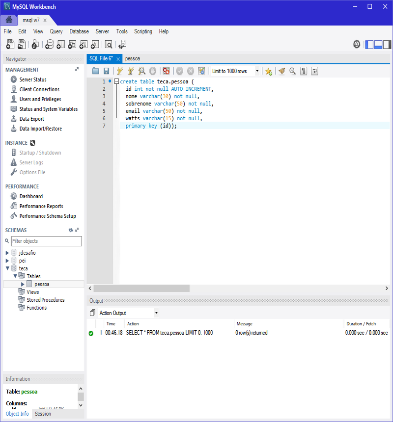
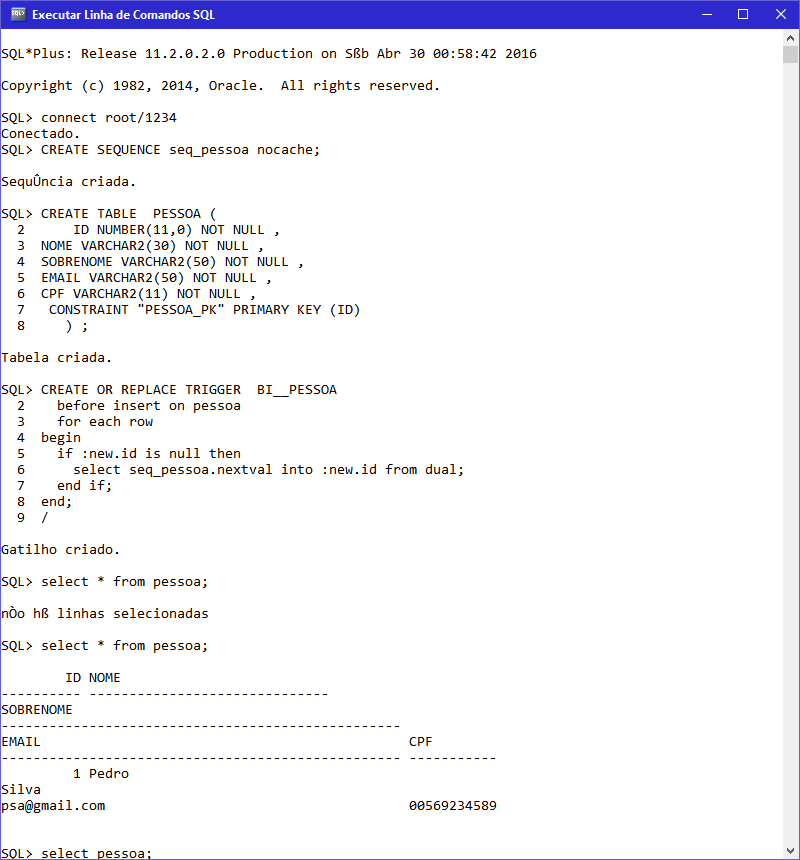
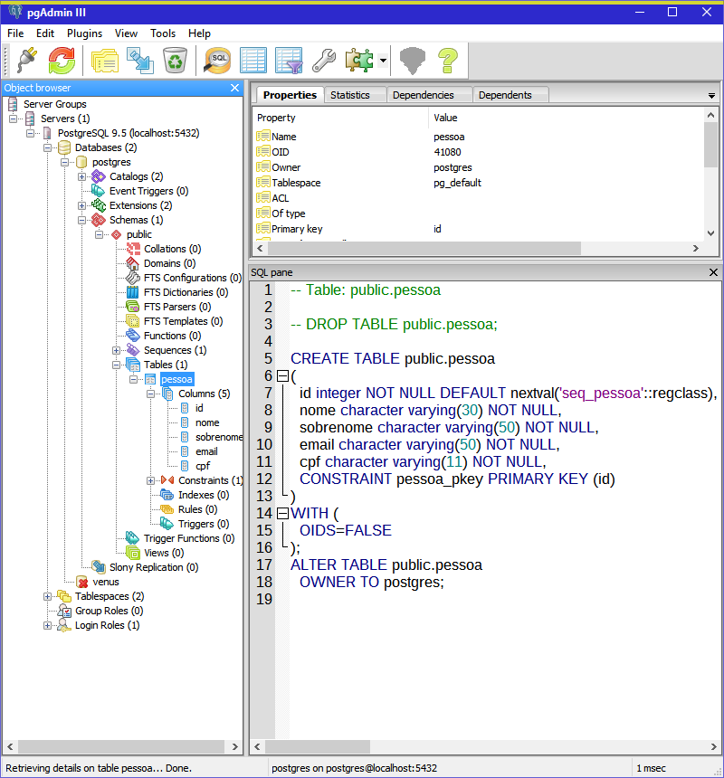
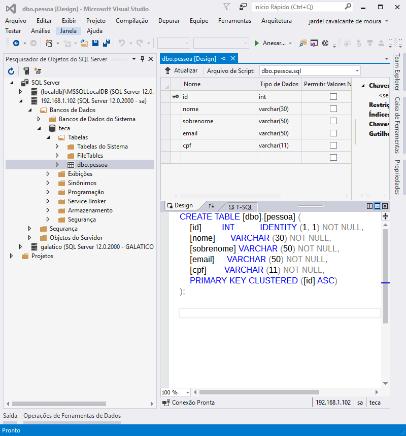

# Conexão   com  banco de dados.

Neste projeto resolvi conectar quatro bancos de dados tais como  Mysql, Oracle, Postgri e Sql Server ao Java usando o drive JDBC.

### Autores.

 Jardel Cavalcante                                           
 jardelsim@hotmail.com
 

### Sobre.

Conexão com banco de dados Mysql, Oracle, Postgri e Sql Server usando drives JDBC, e JPA com Hibernate no Mysql , não vou aqui discutir qual os benefícios de uma ou de outra abordagem até mesmo porque não sei, mas o intuito aqui é servir de guia simples para quem está aprendendo como eu.

### Implementado.

1. *Conexão* com [Mysql](src/com/jems/cbd/mysql/).
2. *Conexão* com [Oracle](src/com/jems/cbd/oracle/).
3. *Conexão* com [Postgri](src/com/jems/cbd/postgri/).
4. *Conexão* com [Sql Server](src/com/jems/cbd/sqlserver/).
5. *Conexão* Mysql com [Jpa e Hibernate](src/com/jems/cbd/hibernate/).

### Java e drives JDBC.

* No Java a especificaçao JDBC padroniza os drives de conexao, e os proprietarios de SGBDs desenvolvem seus drives de acordo com tais especificaçoes  e os distribuem. ex: postgresql-9.4.1208.jar é o drive JDBC para conexao de Java com o Postgri.

### Java e JPA com Hibernate.

* No Java a especificação JPA padroniza as ferramentas de ORM.                                                                 
* O Hibernate é uma ORM "Object Relational Mapper" usado para automatizar a transição de dados de aplicações Java "orientados a objetos" com tabelas de SGBDs "modelo relacional", facilidades como consultas independentes da linguagem Sql estão presentes.

### Configuraçoes ferramentas e recursos.

* Ide [Eclipse](http://goo.gl/aw4gLa "clique aqui para baixar!") | Encoding UTF-8  
* Java [Jdk](http://goo.gl/xqKdB "clique aqui para baixar!") | [Jre](http://goo.gl/aYhlDt "clique aqui para baixar!") 
* Banco de Dados [MySql](http://dev.mysql.com/downloads/mysql/ "clique aqui para baixar!") |
[Oracle](http://www.oracle.com/technetwork/pt/database/express-edition/downloads/index.html "clique aqui para baixar!") |
[PostgriSql](http://www.postgresql.org/download/ "clique aqui para baixar!") |
[Sql Server](https://www.microsoft.com/pt-br/server-cloud/products/sql-server-editions/sql-server-express.aspx "clique aqui para baixar!")
* Drive JDBC [MySql](lib/mysql/mysql-connector-java-5.1.38-bin.jar "clique aqui para baixar!") |
[Oracle](lib/oracle/ojdbc5.jar "clique aqui para baixar!") |
[PostgriSql](lib/postgri/postgresql-9.4.1208.jar "clique aqui para baixar!") |
[Sql Server](lib/sql server/sqljdbc42.jar "clique aqui para baixar!")
* Orm [Hibernate](lib/hibernate/ "clique aqui para baixar!")

# Tabela pessoa.
-----------------------------------
### Mysql.
[tabela.sql](res-externos/sql/mysql.sql "clique aqui para ver aquivo!")    

### Oracle Database XE 11g.
[tabela.sql](res-externos/sql/oracle.sql "clique aqui para ver aquivo!")    

### Postgri.
[tabela.sql](res-externos/sql/postgri.sql "clique aqui para ver aquivo!")    

### Sql Server
[tabela.sql](res-externos/sql/sqlserver.sql "clique aqui para ver aquivo!")    

-------------------------------------

